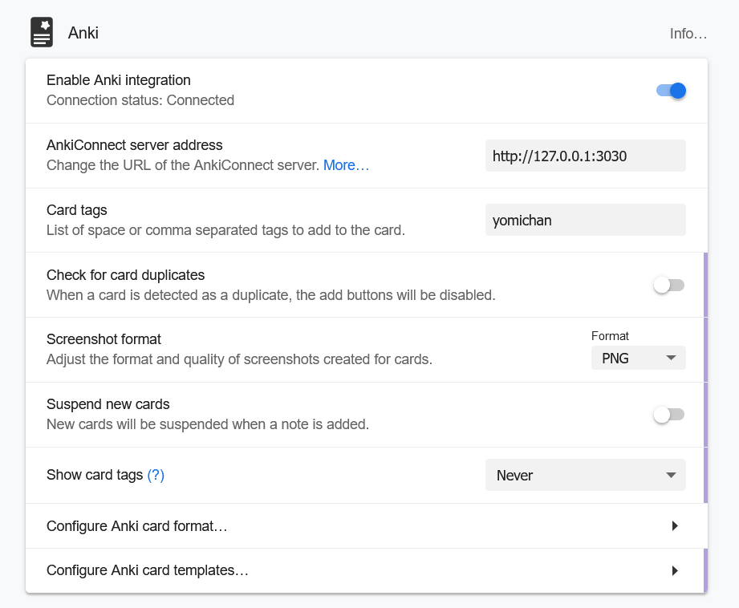
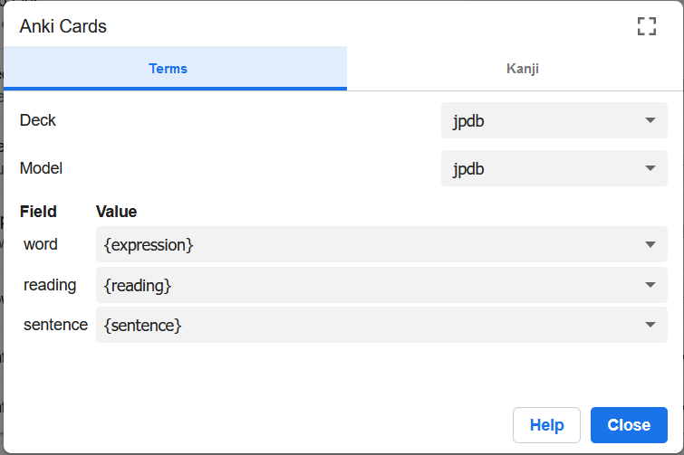

# JPDB-connect

Connect [yomichan](https://github.com/FooSoft/yomichan) with [jpdb](https://jpdb.io) via [anki-connect](https://foosoft.net/projects/anki-connect/) protocol.

At the moment this program has the following features, which can be turned on or off individually:
- open vocab that is added via yomichan in a jpdb-tab (does not require login)
- automatically add that vocab to a specified deck (does require session cookie, need to edit config)
- automatically unlock and/or add vocab to the front of the review queue (FORQ)

## How to use:

Download a zip appropiate for your OS from [releases](https://github.com/kampffrosch94/jpdb-connect/releases), extract the executable inside and run it.

Set up Yomichan to look for a server at "localhost:3030".

"Check for card duplicates" should be *off*.

Click on "configure Anki card format" and set it up like this:

## Configuration

jpdb_connect will create a configuration file in the directory the binary is stored.

Most of the options are commented out. They have comments describing them.

You can see the default config file [here](src/default_config.toml).
